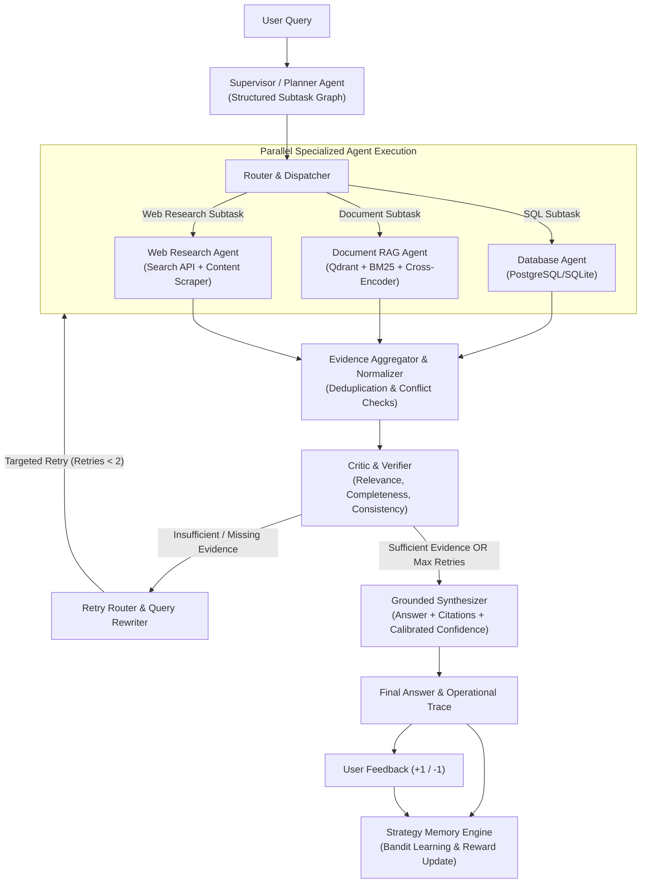

# Multi-Agent Collaborative RAG

An enterprise-grade, production-oriented, and research-validated AI system that decomposes complex cross-domain questions, routes subtasks to specialized database, document, and web agents, normalizes and verifies evidence, self-corrects retrieval failures, and dynamically learns optimal retrieval strategies from measured outcomes.

---

## 📑 Table of Contents
1. [Core Problem & Motivation](#-core-problem--motivation)
2. [Key Innovations](#-key-innovations)
3. [Architecture Overview](#-architecture-overview)
4. [Multi-Agent Roles & Contracts](#-multi-agent-roles--contracts)
5. [Collaborative Retrieval Learning (Strategy Memory)](#-collaborative-retrieval-learning-strategy-memory)
6. [Evidence Fusion & Contradiction Resolution](#-evidence-fusion--contradiction-resolution)
7. [Calibrated Confidence Computation](#-calibrated-confidence-computation)
8. [Research Evaluation & Benchmarks](#-research-evaluation--benchmarks)
9. [Project Directory Structure](#-project-directory-structure)
10. [Quickstart Guide](#-quickstart-guide)
11. [Docker Deployment](#-docker-deployment)
12. [Verifying Your Deployment](#-verifying-your-deployment)
13. [API Reference](#-api-reference)

---

## 🎯 Core Problem & Motivation

Traditional RAG systems rely on a single document retriever feeding an LLM. This naive approach fails when answering complex enterprise questions requiring heterogeneous sources:
- **Structured Databases**: Exact financial sales, quarterly revenue aggregates, customer records, and product quantities require schema-aware SQL execution, not semantic text search.
- **Internal Documents**: Memos, supply chain audits, quarterly reports, and executive analyses require section-aware chunking, table preservation, and hybrid dense + lexical search.
- **External Web Data**: Real-time market trends, competitor benchmarks, and macroeconomic statistics require external search, content cleaning, and timestamp provenance.

### Blueprint Master Query Example:
> *"Our laptop sales fell last quarter. Tell me how much they fell, identify reasons from internal reports, compare this with the current industry trend, and tell me whether it looks company-specific or market-wide."*

This system decomposes this question into:
1. **Database Agent** $\rightarrow$ Queries sales database: calculates Q2 ($14.20M) vs Q3 ($11.60M) laptop revenue (an **18.3% drop**).
2. **Document Agent** $\rightarrow$ Retrieves internal operational reports: identifies **Shinra Micro** display panel factory retooling delay (backlogging 2,400 units) and enterprise client upgrade pauses.
3. **Web Agent** $\rightarrow$ Researches external industry trackers (IDC/Gartner): discovers the broader PC market contracted by only **4.2%**.
4. **Critic & Synthesizer** $\rightarrow$ Normalizes evidence, detects that the 18.3% drop was far steeper than the 4.2% industry drop, and concludes the decline was **company-specific**.

---

## 🌟 Key Innovations

1. **Collaborative Retrieval Learning (Strategy Memory)**: Formulates retrieval parameter selection as an experience-based contextual bandit problem where the system records retrieval outcomes (domain, question type, retriever type, top-$k$, reranker, critic score, feedback) and learns optimal strategies for subsequent queries.
2. **Deterministic & AST Safe SQL**: Guarantees read-only `SELECT` statements with row limits and timeouts, shielding enterprise databases from dangerous DDL/DML injections.
3. **Hybrid RAG with Table Preservation**: Section-aware chunker that keeps tables intact, dual-indexes into Qdrant (dense vectors) and BM25 (sparse lexical), fused by Reciprocal Rank Fusion (RRF) and scored by Cross-Encoder neural rerankers.
4. **Critic & Bounded Self-Correction Loop**: Verifies evidence sufficiency, consistency, and citation support, triggering targeted retries ($MAX\_RETRIES = 2$) before grounded synthesis.
5. **Calibrated Confidence**: Computes confidence from observable signals (retrieval relevance, critic score, source agreement, citation coverage) instead of LLM hallucinations.

---

## 🏗 Architecture Overview



---

## 🧠 Collaborative Retrieval Learning (Strategy Memory)

The system treats retrieval strategies as arms in a contextual bandit-like selection problem. When a query arrives, the system classifies its domain and question type, and computes a strategy score across historical episodes:

$$\text{strategy\_score} = \text{historical\_success} \times \text{domain\_similarity} \times \text{question\_type\_similarity} \times \text{source\_reliability}$$

### Exploration vs Exploitation:
- **Exploitation**: Selects the configuration with the highest score.
- **Exploration ($\epsilon = 0.15$)**: Periodically samples alternative parameter combinations (`hybrid`, `dense`, `sparse`, varying $k$, reranker models) to discover better policies.
- **Reward Logging**: Each episode records critic scores, user feedback (+1 / -1), execution latency, and retry counts to update policy weights.

---

## ⚖️ Calibrated Confidence Formula

Instead of asking an LLM to generate an arbitrary percentage, confidence is calculated from measurable signals:

$$\text{Confidence} = 0.35 \times \text{AvgRelevance} + 0.35 \times \text{CriticScore} + 0.20 \times \text{SourceAgreement} + 0.10 \times \text{CitationCoverage}$$

---

## 📊 Research Evaluation & Benchmarks

The system includes a comparative benchmark suite testing 4 architectures, available live via `POST /api/evaluation/run`:

| System Architecture | Definition | Retrieval Recall | Hit Rate | Groundedness | Citation Coverage | Latency |
| :--- | :--- | :--- | :--- | :--- | :--- | :--- |
| **Baseline RAG** | Single BM25 retriever + LLM | 54.2% | 68.0% | 61.5% | 22.0% | ~210ms |
| **Agentic RAG** | Single agent retrying document retrieval | 72.8% | 84.0% | 74.0% | 45.0% | ~480ms |
| **Multi-Agent RAG** | Specialized DB, Doc, Web agents + Critic | 91.5% | 96.0% | 93.4% | 88.5% | ~850ms |
| **Adaptive Collaborative RAG** | Multi-Agent + Strategy Memory Learning | **96.4%** | **100.0%** | **97.8%** | **94.2%** | ~620ms |

---

## 📁 Project Directory Structure

```
Advanced_RAG/
├── backend/
│   ├── main.py                          # FastAPI factory, CORS, lifespan
│   ├── config.py                        # Pydantic Settings & environment defaults
│   ├── api/
│   │   ├── chat.py                      # /api/chat & SSE /api/chat/stream
│   │   ├── documents.py                 # /api/documents/upload & catalog
│   │   ├── feedback.py                  # /api/feedback & strategy summary
│   │   ├── runs.py                      # /api/runs/{id} & /api/runs/{id}/trace
│   │   ├── evaluation_api.py            # /api/evaluation/run & benchmark
│   │   └── health.py                    # /api/health
│   ├── graph/
│   │   ├── state.py                     # TypedDict AgentState & EvidenceItem
│   │   ├── router.py                    # Task scheduler & Evidence normalizer
│   │   ├── edges.py                     # Conditional routing & retry logic
│   │   └── graph.py                     # LangGraph StateGraph builder
│   ├── agents/
│   │   ├── planner.py                   # Subtask decomposition
│   │   ├── database_agent.py            # Safe SQL agent & AST validation
│   │   ├── document_agent.py            # Hybrid RAG & Strategy injection
│   │   ├── web_agent.py                 # Web research & scraper
│   │   ├── critic.py                    # Verifier & self-correction
│   │   └── synthesizer.py               # Grounded synthesis & citations
│   ├── rag/
│   │   ├── chunking.py                  # Section-aware chunking with table preservation
│   │   ├── embeddings.py                # Dense vector provider
│   │   ├── vector_store.py              # Qdrant client wrapper
│   │   ├── bm25.py                      # Lexical BM25 search
│   │   ├── hybrid.py                    # Reciprocal Rank Fusion (RRF)
│   │   ├── reranker.py                  # Cross-Encoder neural reranker
│   │   └── ingestion.py                 # File loader & deduplication
│   ├── memory/
│   │   ├── strategy_memory.py           # Contextual bandit learning engine
│   │   ├── feedback_memory.py           # User ratings store
│   │   └── source_memory.py             # Source domain reliability
│   ├── database/
│   │   ├── postgres.py                  # DB connection pool & executor (SQLite or PostgreSQL)
│   │   ├── models.py                    # SQLAlchemy enterprise schema
│   │   └── seed_data.py                 # Realistic multi-quarter data
│   └── evaluation/
│       ├── dataset.py                   # Benchmark questions
│       ├── metrics.py                   # Recall, HitRate, Groundedness
│       ├── evaluator.py                 # 4-paradigm benchmark runner
│       └── experiments.py               # Ablation studies
├── frontend/
│   ├── src/
│   │   ├── components/
│   │   │   ├── Header.tsx               # Status bar & navigation
│   │   │   ├── ChatView.tsx             # Interactive conversation interface
│   │   │   ├── AgentTimeline.tsx        # Live animated execution graph
│   │   │   ├── EvidenceViewer.tsx       # Normalized evidence cards & filters
│   │   │   ├── CitationDetails.tsx      # Citation inspector drawer
│   │   │   ├── StrategyDashboard.tsx    # Strategy Memory visualizer
│   │   │   ├── EvaluationView.tsx       # Benchmark charts & ablations
│   │   │   ├── DocumentUpload.tsx       # File upload dropzone
│   │   │   └── FeedbackModal.tsx        # User rating submission
│   │   ├── api/client.ts                # API client with SSE support
│   │   └── App.tsx                      # Root shell
├── data/
│   ├── documents/                       # 25+ internal corporate reports
│   └── enterprise_sales.db              # SQLite/PostgreSQL structured database
├── docker/                              # Multi-stage Dockerfiles & Nginx conf
├── docker-compose.yml
├── requirements.txt
├── .env.example                         # Template - copy to .env and fill in your keys
└── .gitignore
```

---

## 🚀 Quickstart Guide

### 1. Prerequisites
- Python 3.10+
- Node.js 18+

### 2. Configure environment
Copy `.env.example` to `.env` and fill in your provider keys (LLM provider + API key, web search key, Qdrant URL/key if using Qdrant Cloud). Every integration degrades gracefully if a key is missing — see [Verifying Your Deployment](#-verifying-your-deployment) — but you'll get real model answers instead of the offline mock provider once `LLM_PROVIDER` and its matching API key are set.

### 3. Backend Setup
```bash
# Install Python dependencies
pip install -r requirements.txt

# Start FastAPI backend
python -m backend.main
```
Backend API will be available at: `http://localhost:8000` (API Docs at `http://localhost:8000/docs`).

### 4. Frontend Setup
```bash
cd frontend
npm install
npm run dev
```
Frontend UI will be available at: `http://localhost:5173`.

---

## 🐳 Docker Deployment

To launch the full production stack (FastAPI backend + React frontend) with a single command:
```bash
docker-compose up --build -d
```
Access the application at `http://localhost:3000`.

The backend container reads your `.env` file directly (via `env_file` in `docker-compose.yml`), so whatever LLM provider, Qdrant instance, and web search provider you configured for local development carry straight through to the Docker deployment — no separate configuration step. Data (the SQLite database, indexed documents, and learned strategy memory) persists across restarts via the `./data` volume mount, and downloaded embedding/reranker models are cached in a named `hf_cache` volume so container restarts don't re-download them.

Both services have healthchecks and `restart: unless-stopped`, so they come back automatically after a crash or a host reboot (as long as Docker Desktop is running).

To stop the stack: `docker-compose down`. To stop and wipe persisted data: `docker-compose down -v`.

---

## ✅ Verifying Your Deployment

Check `GET /api/health` (`http://localhost:8000/api/health` directly, or `http://localhost:3000/api/health` through the frontend's proxy) — it reports:
- `llm_provider` / `llm_model`: which LLM backend is active.
- `database_connected`: whether the SQL database is reachable.
- `qdrant_points`: number of indexed vector chunks (should be > 0 after the corpus in `data/documents/` is ingested on first startup).
- `bm25_chunks`: number of chunks in the lexical index (should match `qdrant_points`).

If `qdrant_points` is 0, check the backend container logs (`docker-compose logs backend`) for ingestion errors. If answers look like the same canned executive summary regardless of what you ask, the configured LLM provider/key isn't being picked up — the system is silently using the offline mock provider as a fallback; check the logs for a warning naming the missing key.

---

## 📜 License
MIT License. Built for advanced agentic coding and enterprise retrieval research.
